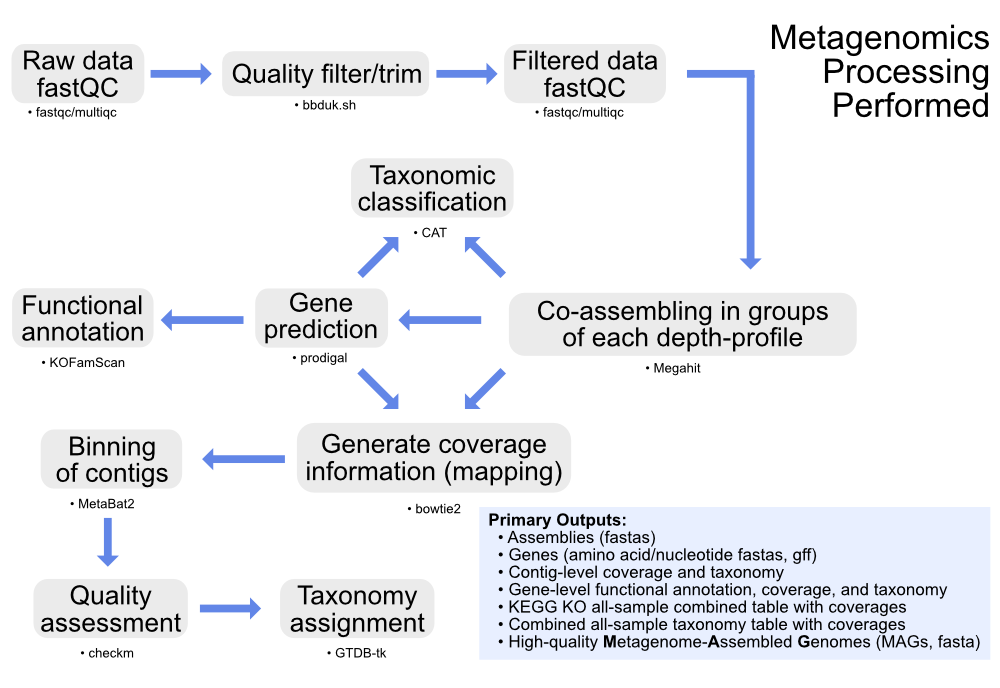

# NASA-Exo-N-project

---
> **Currently under development**
---

## Overview

---

--- 

The [workflow directory](workflow) holds the primary [Snakefile](workflow/Snakefile)and all associated files for our metagenomics processing. See the [config.yaml](workflow/config.yaml) file for variables that need to be set and an example input file specifying the samples and groups for co-assembly and analysis.

--- 

#### Note on reference databases
The workflow will check for the required reference databases in the locations specified in the [config.yaml](workflow/config.yaml) file, and download and set them up if they are not present already. They take up around 260GB after installed, but require up to 500GB during downloading and initial unpacking. See [config.yaml](workflow/config.yaml) for more info. If you have trouble pointing to already-present databases, let me know, this hasn't been made all that robust to changes yet. 
